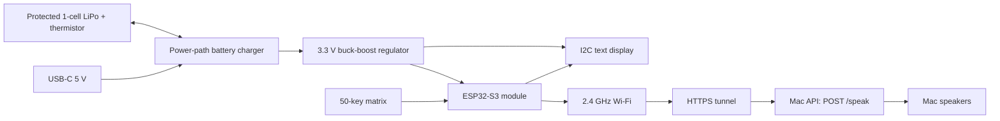

# Wi-Fi text-to-speech keyboard — revision A design proposal

Status: electrical architecture and keyboard connection design. This is not a routed PCB or a manufacturing release. Keyboard size, exact display, battery pack, enclosure, component footprints, and power-stage values must be finalized before CAD layout and fabrication.

## User experience

Type a message on the built-in keyboard, review it on the display, then press the dedicated SEND key. The device sends the existing API request over Wi-Fi; the Mac running this repository speaks it. Keep the text on screen until success; preserve it after an error. SEND is separate from ENTER to avoid accidental playback while editing.

Confirmed requirements: built-in keyboard, explicit send button, Wi-Fi, battery operation. Proposed additions: monochrome display, USB-C charging/programming, power switch. Initial mechanical assumption: handheld thumb keyboard; dimensions remain provisional pending user preference.

## System connections



## Main components

| Block | Proposed component | Purpose / selection condition |
| --- | --- | --- |
| MCU / radio | ESP32-S3-MINI-1, PCB-antenna variant | Direct keyboard scanning, display, HTTPS and USB programming; choose current orderable flash variant before BOM release |
| Display | 128 × 64 I2C OLED module, 3.3 V compatible | Review a scrolling message; require a documented module drawing and controller before selecting a footprint |
| Keyboard | 50 normally-open switches + 50 1N4148W diodes | Five rows × ten columns; switches/keycaps depend on thumb versus desktop size |
| Charger | TI BQ24074 | Single-cell 4.2 V charging with system power path and battery thermistor input |
| Regulator | TI TPS63070 | Buck-boost to hold 3.3 V as battery voltage crosses 3.3 V; design target at least 0.8 A across intended battery range |
| Battery | Protected 1S, nominal 3.7 V LiPo, approximately 2,000 mAh, with NTC | Exact pack must support selected charge/discharge currents and fit the enclosure |
| USB | USB-C USB 2.0 receptacle | Charging and programming, with CC detection, data-line ESD protection and input protection |
| Service | BOOT, RESET, UART test pads | Recovery/programming and bring-up |

The [Espressif module datasheet](https://documentation.espressif.com/esp32-s3-mini-1_mini-1u_datasheet_en.html) provides the module pinout, native USB and antenna land pattern. The [BQ24074 datasheet](https://www.ti.com/lit/gpn/bq24074) defines charge programming, power-path behavior and temperature monitoring. The [TPS63070 datasheet](https://www.ti.com/lit/ds/symlink/tps63070.pdf) supplies the regulator reference circuit and layout.

## Keyboard circuit and pin allocation

GPIO numbers below are firmware identifiers, not physical module pad numbers. Match these names to module pads during schematic capture.

| Function | ESP32-S3 GPIO | Connection |
| --- | --- | --- |
| ROW0–ROW4 | 4, 5, 6, 7, 8 | One matrix row per GPIO |
| COL0–COL9 | 9, 10, 11, 12, 13, 14, 15, 16, 17, 18 | Each column has a 10 kΩ pull-up to 3.3 V |
| Display SDA / SCL | 1 / 2 | 4.7 kΩ pull-ups to 3.3 V; account for pull-ups already on display |
| USB D− / D+ | 19 / 20 | USB receptacle through ESD protection and reference-design series resistors |
| Status LED | 21 | GPIO → 1 kΩ → LED anode; cathode to ground |
| BOOT | 0 | 10 kΩ pull-up; service button to ground |
| RESET | EN | 10 kΩ pull-up, 1 µF to ground, service button to ground |
| Recovery UART TX / RX | 43 / 44 | Test pads plus ground; 3.3 V logic |

Keep GPIO3, GPIO45 and GPIO46 free of application loads because they participate in boot configuration. Reserve unused pins for power management after the USB current-detection circuit is chosen. See [Espressif's S3 schematic guidelines](https://docs.espressif.com/projects/esp-hardware-design-guidelines/en/latest/esp32s3/schematic-checklist.html).

Each key is wired: **column → switch → diode anode → diode cathode (stripe) → row**. Select one row low; leave other rows high-impedance. A pressed key reads low on its column. Diodes allow SHIFT plus letter combinations without ghost keys. Scan approximately every 5 ms and debounce for 20 ms. A held SEND key generates only one send event until released.

Proposed electrical matrix (visual placement can be staggered independently):

| Row | C0 | C1 | C2 | C3 | C4 | C5 | C6 | C7 | C8 | C9 |
| --- | --- | --- | --- | --- | --- | --- | --- | --- | --- | --- |
| R0 | 1 | 2 | 3 | 4 | 5 | 6 | 7 | 8 | 9 | 0 |
| R1 | Q | W | E | R | T | Y | U | I | O | P |
| R2 | A | S | D | F | G | H | J | K | L | Backspace |
| R3 | Shift | Z | X | C | V | B | N | M | . | Enter |
| R4 | Fn | , | ? | ' | Space | Left | Right | Home | End | SEND |

SHIFT provides capitals and symbols. FN provides settings and less common punctuation; FN+Backspace clears only after an on-screen confirmation. Firmware initially supports English text entry; another language requires a different input method. Firmware maps logical positions to the eventual physical layout.

## Battery and charging circuit

USB VBUS feeds the protected charger input. The battery connects to BAT; the system is powered from OUT, not directly from BAT. OUT feeds the buck-boost stage. A power switch controls regulator enable so the unit can charge while switched off. Prevent any signals from an always-powered circuit from back-powering the switched 3.3 V rail.

Use a real battery thermistor matched to the charger TS network, not a fixed resistor pretending the battery is always at room temperature. A keyed battery connector carries BAT+, ground and NTC; assign its polarity to the selected battery drawing. The pack needs overcharge, overdischarge and short-circuit protection in addition to the charger.

Initial charging target: 500 mA, subject to the selected cell specification. For BQ24074, nominal RISET = 890 / 0.5 = 1.78 kΩ; use 1% and check tolerance limits against the cell rating. Select termination, timer, TS network and capacitors from the full reference circuit after the battery is fixed. Account for approximately 1 W charger dissipation at 5 V input, 3 V battery and 500 mA charging, before system-path losses.

USB-C needs separate 5.1 kΩ Rd resistors on CC1 and CC2. These alone do not authorize arbitrary charging current. Include a sink CC detector/controller and use its advertised-current result, plus USB enumeration state where applicable, to control the charger's input limit. Default conservatively to 100 mA until an allowed higher limit is established. The battery can supplement the system load; an empty or absent battery may require delaying Wi-Fi startup. USB suspend must also be handled. No USB PD voltage above 5 V is needed.

Regulator implementation: use the TPS63070 reference topology, select inductor saturation current and output capacitance for 0.8 A transient load at the lowest permitted battery voltage, and verify thermal and transient performance. Do not equate switch-current rating with available output current. Place local bulk and 100 nF decoupling at the MCU and display. Final passives and exact protection/controller parts remain open schematic work.

Rough runtime planning only: 2 Ah × 3.7 V × 85% efficiency / (3.3 V × 0.15 A) ≈ 12.7 hours. With 20% capacity reserve, approximately 10 hours. The assumed 150 mA average is unmeasured; display brightness, Wi-Fi conditions and sleep strategy will determine actual runtime.

## API and firmware behavior

The existing server binds to 127.0.0.1:8000. The PCB cannot reach it using its own localhost address or the Mac's LAN IP with the current configuration. Use the project's HTTPS tunnel URL ending in `/speak`; the Mac, server and tunnel must remain running. No server changes are necessary for this path.

```http
POST /speak HTTP/1.1
Host: YOUR-TUNNEL-DOMAIN
Content-Type: application/json

{"api_key":"DEVICE_CONFIGURED_SECRET","message":"The text typed on the keyboard"}
```

Provision Wi-Fi credentials, the HTTPS URL and API key locally through USB. Never embed this project's real `.env` contents in source or a public artifact. Validate the HTTPS certificate and hostname using a trust store and valid clock; fail closed when validation fails. Do not use an insecure TLS mode or automatically follow redirects carrying the secret.

Maintain a maximum 500-character editor buffer and JSON-encode it using a library. Show a character counter and wrap/scroll the display. Ignore SEND while an operation is pending; keep scanning/editing in a separate task from networking. Take an immutable copy of the submitted message so later edits do not alter the request or disappear when it completes.

| Event | Device behavior |
| --- | --- |
| SEND on blank text | Show “Type a message first” |
| Wi-Fi disconnected | Keep draft, show connection status |
| Request sent | Show “Waiting for speech…” |
| HTTP 200 and `spoken: true` | Show “Speech completed”; retain draft for deliberate editing/reuse |
| HTTP 401 | Show “API key rejected” |
| HTTP 429 | Show busy/rate-limit status; respect `Retry-After` before another send |
| HTTP 503 / 504 | Show playback failure; retain message |
| Transport timeout / disconnect | Show “Outcome unknown—check before resending” |

Allow a response wait longer than the server's 90-second speech timeout, e.g. 105 seconds. Do not automatically repeat a submitted POST: speech may have played even if the response was lost. The server accepts five messages per rolling minute globally and one playback at a time. These details are verified against `src/texttospeechapi/__init__.py` and `README.md` in this repository.

## Physical PCB proposal and release work

For a thumb keyboard, start around 120 × 90 mm with an approximately 10 mm key pitch, display above the keys, USB-C at the top, and the battery secured beneath the board in the enclosure. This is a packaging study, not a verified fit. A desktop keyboard uses different switches and substantially larger dimensions.

Use a four-layer board: components/signals, continuous ground, power/secondary signals, bottom signals. Keep the radio antenna at an unobstructed edge; apply the exact module antenna keepout to all layers and keep battery metal away from it. Place the charger, switcher and battery connector together away from the antenna. Route USB as a short 90 Ω differential pair using the fabricator's stackup. Keep a continuous return plane beneath USB and keep switcher high-current loops compact. Provide test points for VBUS, BAT, SYS, 3V3, ground, EN and UART.

Before ordering boards: choose the exact keyboard mechanics, display and battery; capture the complete schematic and BOM; verify every symbol/footprint against manufacturer drawings; route the board; pass ERC and DRC; inspect antenna clearance and enclosure fit; export Gerbers, drills and assembly outputs. None of those manufacturing artifacts are included yet.

Prototype verification must cover matrix combinations, USB in both orientations, battery-only startup, use while charging, input-current limits, battery temperature faults, regulator droop during Wi-Fi transmission, sleep/wake, and the API response cases above. Hardware operation and battery runtime have not been tested.
